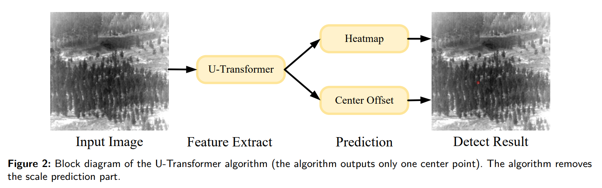
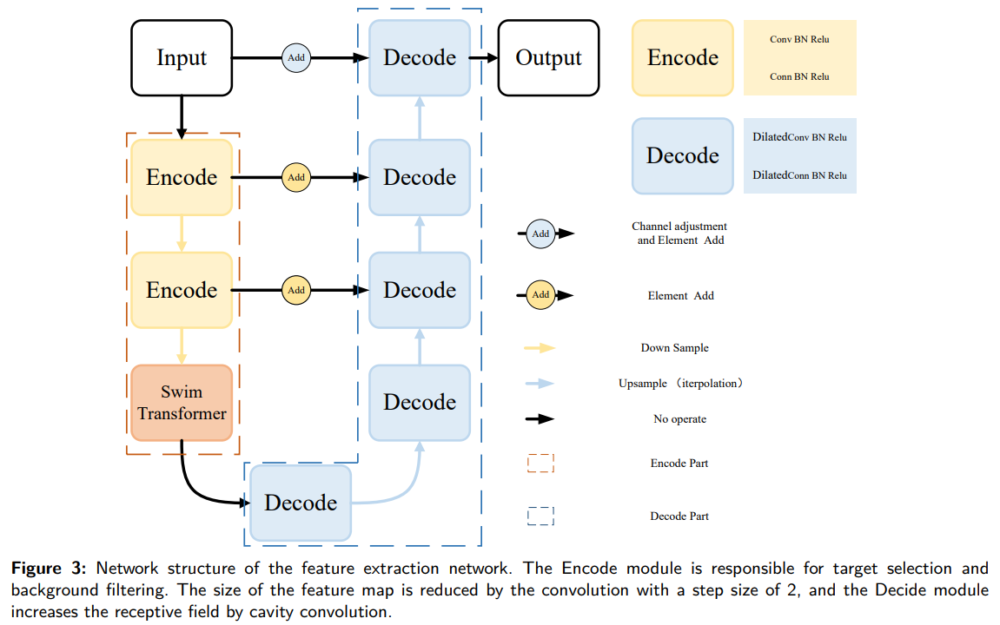

# Infrared Dim Small Target Detection Based On U-Transformer





## ABSTRACT

Infrared dim and small target detection is a key technology for space-based infrared search and tracking systems. The traditional detection algorithms have a high false alarm rate and fail to handle complex background and high-noise scenarios. Also, the algorithms cannot effectively detect targets on a small scale. In this paper, a U-Transformer based on Center Net is proposed, and the Swin Transformer is introduced into the infrared dim small target detection algorithm for the first time. First, a U-shaped network is constructed. In the encoder part, the self-attention mechanism of the Swin transformer is used for infrared dim and small target feature extraction, which helps to solve the problems of losing dim and small target features in deep networks. Meanwhile, by using the encoding and decoding structure, infrared dim and small target features are filtered from the complex background while the shallow features and semantic information of the target are retained. Experiments show that the anchor free and the Swin transformer have great potential for infrared dim small target detection. On the datasets with a complex background, our algorithm outperforms the state-of-the-art algorithms and meets the real-time requirement.

## [Datasets](#Infrared-Dim-Small-Target-Detection-Based-On-U-Transformer)

[A dataset for infrared detection and tracking of dim-small aircraft targets under ground / air background](http://www.csdata.org/p/387/)

## [Usage](#Infrared-Dim-Small-Target-Detection-Based-On-U-Transformer)

### Train

#### prepare train and test list
in train.txt and test.txt
```shell
image_path x,y,0
```


### Inference


### Evaluation

## [Results](#Infrared-Dim-Small-Target-Detection-Based-On-U-Transformer)

## [TODO](#Infrared-Dim-Small-Target-Detection-Based-On-U-Transformer)


